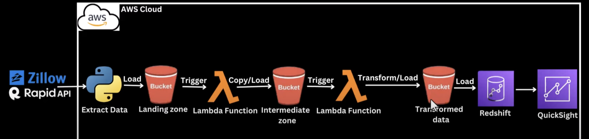
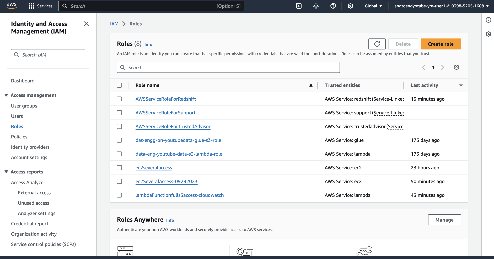
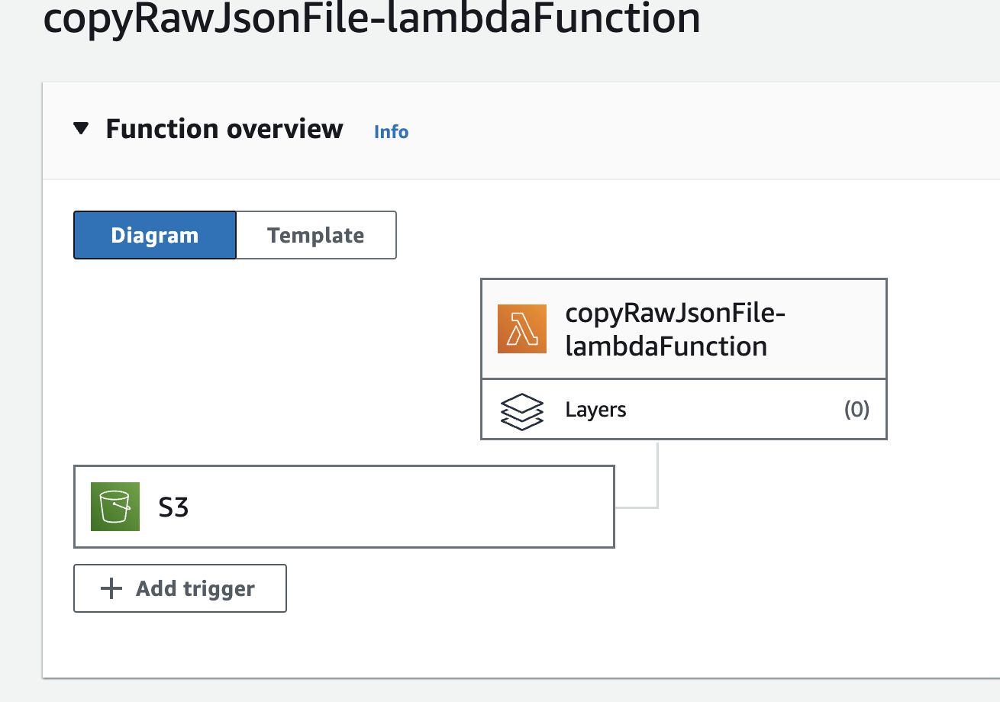
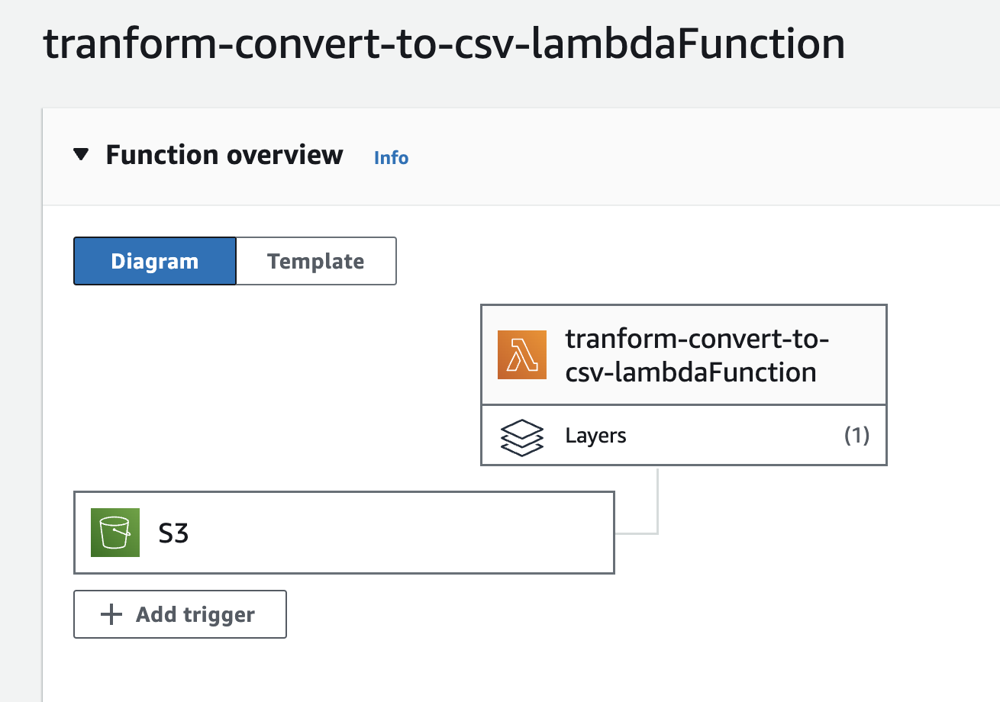
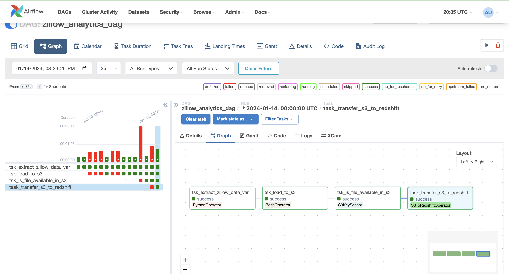
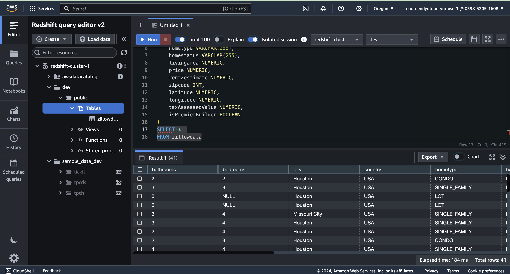

# ETL Data pipeline for Zillow Data Analytics on AWS

### Basic Pipeline 
Data pipeline from data extraction to building analytics dashboards to find insights from the extracted data. Here data is extracted, stored in S3, transformed, loaded to RedShift and finally to QuickSight for deriving insights through graphs and plots. The entire process is done using the AWS services and Apache Airflow for the orchestration of tasks. 

## Extract
1. Used Rapid API (internally REST) to retrieve data in json format using the Python operator. 
2. Bash operator to move data from EC2 to S3 bucket. 
3. Created IAM Roles to permit one service to access another: 

## Transform
1. Lambda function to copy the data to another S3 bucket. Triggered when a file is created in landing zone S3. 

2. Lambda function to transform data, select necessary columns, row and convert to csv. 

## Load
1. Key Sensor checks for files in the cleaned S3 bucket. If found, move to RedShift. 

2. Create a RedShift cluster and a table to store data in tabular format. 

3. Finally, connect QuickSight to RedShift to derive meaningful insights from the data. 

